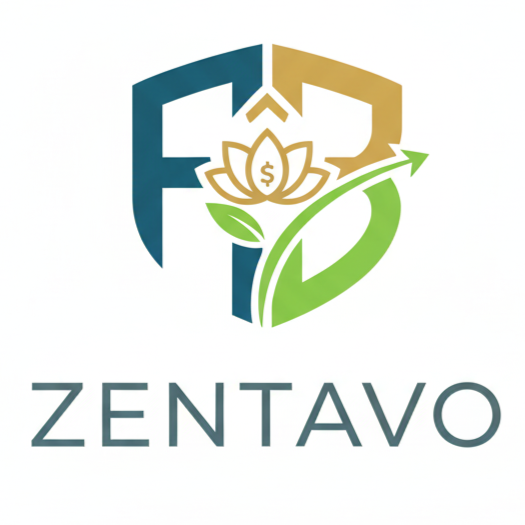

# 💰 Zentavo - Control de Gastos Inteligente

<div align="center">



**Tu compañero financiero personal**

[](https://flutter.dev)
[]()
[]()
[](https://github.com/florenciaballonlp-create/Zentavo/actions)
[](https://github.com/florenciaballonlp-create/Zentavo/actions)
[](https://github.com/florenciaballonlp-create/Zentavo/actions)

[🚀 Características](#-características-principales) •
[📱 Instalación](#-instalación) •
[📖 Manual de Uso](#-manual-de-uso-completo) •
[🌍 Idiomas](#-idiomas-soportados) •
[💎 Premium](#-funciones-premium)

</div>

---

## 📝 Descripción

**Zentavo** es una aplicación completa de control de gastos y finanzas personales diseñada para ayudarte a gestionar tu dinero de forma inteligente. Con funciones avanzadas de seguimiento de transacciones, eventos compartidos, ahorros y análisis, Zentavo te permite tener el control total de tus finanzas desde cualquier dispositivo.

### 🎯 ¿Por qué Zentavo?

- ✅ **Fácil de usar**: Interfaz intuitiva y moderna
- ✅ **Multiplataforma**: Funciona en Android, iOS y Windows
- ✅ **Multi-idioma**: Soporta 6 idiomas diferentes
- ✅ **Sin complicaciones**: Configuración en segundos
- ✅ **Eventos compartidos**: Perfecto para gastos grupales
- ✅ **Totalmente funcional offline**: No requiere conexión a internet

---

## ✨ Características Principales

### 💸 Gestión de Transacciones
- **Ingresos y Egresos**: Registra todas tus transacciones con categorías personalizadas
- **Filtros avanzados**: Por fecha, categoría, monto y tipo
- **Búsqueda rápida**: Encuentra cualquier transacción al instante
- **Historial completo**: Revisa todas tus operaciones

### 🎉 Eventos Compartidos
- **Gastos grupales**: Organiza viajes, cenas y eventos con amigos
- **División automática**: Calcula quién debe a quién
- **Participantes ilimitados**: Agrega tantas personas como necesites
- **Balance inteligente**: Ve deudas optimizadas entre participantes
- **Solicitudes de pago** 💎: Envía recordatorios via WhatsApp/SMS
- **Códigos QR de pago** 💎: Genera QR para pagos rápidos
- **Deep links de pago** 💎: Abre apps como Mercado Pago, PayPal, Venmo
- **Notificaciones**: Comparte eventos por WhatsApp o email

### 🏦 Control de Ahorros
- **Metas de ahorro**: Define objetivos financieros
- **Seguimiento visual**: Ve tu progreso con gráficos
- **Proyecciones**: Calcula cuándo alcanzarás tu meta
- **Aportes flexibles**: Agrega dinero cuando quieras

### 📊 Gastos Fijos
- **Suscripciones**: Netflix, Spotify, gimnasio, etc.
- **Servicios**: Luz, agua, internet, alquiler
- **Recordatorios**: Nunca olvides un pago importante
- **Proyección mensual**: Sabe cuánto gastarás cada mes

### 🎨 Categorías Personalizadas
- **Crea tus propias categorías**: Organiza gastos a tu manera
- **Iconos y colores**: Personaliza la apariencia
- **Subcategorías**: Organización detallada
- **Estadísticas por categoría**: Análisis visual de gastos

### 🌍 Multi-Moneda
- **Soporte para múltiples divisas**: USD, EUR, ARS, BRL, MXN, etc.
- **Conversión automática**: Ve todo en tu moneda preferida
- **Actualización de tasas**: Mantén valores actualizados

### 👤 Mi Perfil (NUEVO)
- **Avatar personalizado**: Sube tu foto de perfil
- **Información personal**: Nombre, email, teléfono
- **Código QR único**: Comparte tu perfil fácilmente
- **Lista de amigos**: Agrega contactos para eventos compartidos
- **Estado Premium**: Ve tu plan activo y tiempo restante
- **Estadísticas**: Transacciones creadas, eventos, ahorros totales

### � Transacciones Recurrentes (v1.1.0)
- **Automatización**: Crea gastos/ingresos que se repiten automáticamente
- **Frecuencias**: Diaria, Semanal, Quincenal, Mensual, Anual
- **Gestión completa**: Pausa, edita o elimina recurrencias
- **Auto-generación**: Las transacciones se crean automáticamente en las fechas programadas

### 💾 Backup y Restauración (v1.1.0)
- **Backup automático**: Cada 7 días se crea una copia de seguridad automática
- **Backup manual**: Crea copias cuando quieras
- **Compartir**: Envía backups por WhatsApp o email
- **Restauración**: Recupera todos tus datos desde un archivo de backup
- **Formato JSON**: Compatible y fácil de usar

### 💎 Premium
- **Sin publicidad**: Experiencia limpia y fluida
- **Solicitudes de pago** 💰: Envía recordatorios personalizados via WhatsApp/SMS
- **Códigos QR de pago** 📱: Genera QR codes para cobros rápidos
- **Deep links de pago** 🔗: Abre Mercado Pago, PayPal, Venmo directamente
- **Eventos compartidos ilimitados**: Sin límite de 5 eventos
- **Categorías personalizadas ilimitadas**: Organiza a tu manera
- **Backup en la nube**: Sincroniza entre dispositivos (próximamente)
- **Análisis IA**: Recomendaciones personalizadas (próximamente)
- **Exportar PDF**: Informes profesionales
- **Soporte prioritario**: Respuestas en menos de 24 horas
- **2 planes disponibles**: Mensual ($2.99) y Anual ($24.99 - ahorra 30%)

---

## 📱 Instalación

### Requisitos Previos

- **Flutter SDK**: 3.10.7 o superior
- **Dart SDK**: 3.0.0 o superior
- Para Android: Android Studio con SDK 21+
- Para iOS: Xcode 14+ (solo en macOS)
- Para Windows: Visual Studio 2022 con C++ tools

### Clonar el Repositorio

```bash
git clone https://github.com/florenciaballonlp-create/Zentavo.git
cd Zentavo
```

### Instalar Dependencias

```bash
flutter pub get
```

### Ejecutar la Aplicación

**En Android/iOS:**
```bash
flutter run
```

**En Windows:**
```bash
flutter run -d windows
```

**Compilar para Producción:**
```bash
# Android
flutter build apk --release

# iOS
flutter build ipa --release

# Windows
flutter build windows --release
```

---

## 📖 Manual de Uso Completo

### 🚀 Primer Uso

#### 1. Idioma Inicial
Al abrir Zentavo por primera vez, selecciona tu idioma preferido:
- 🇪🇸 Español
- 🇺🇸 English
- 🇧🇷 Português
- 🇮🇹 Italiano
- 🇨🇳 中文 (Chino)
- 🇯🇵 日本語 (Japonés)

El idioma se puede cambiar en cualquier momento desde el menú **Configuración**.

#### 2. Pantalla Principal
La pantalla principal muestra:
- **Balance Total**: Ingresos - Egresos
- **Botones de acceso rápido**: Transacciones, Ahorros, Eventos
- **Gráficos**: Resumen visual de finanzas
- **Acceso rápido**: A todas las funciones principales

---

### 💸 Gestión de Transacciones

#### Crear una Nueva Transacción

1. **Acceder**: Toca el botón "Transacciones" en la pantalla principal
2. **Nuevo**: Presiona el botón flotante `+` (círculo verde en la esquina inferior derecha)
3. **Completar datos**:
   - **Tipo**: Selecciona "Ingreso" o "Egreso"
   - **Monto**: Ingresa la cantidad (ej: 150.50)
   - **Categoría**: Elige de la lista o crea una nueva
   - **Descripción**: Detalla el concepto (opcional)
   - **Fecha**: Selecciona la fecha de la transacción
   - **Moneda**: Elige la divisa (opcional, predeterminado: moneda local)
4. **Guardar**: Toca "Crear Transacción"

#### Ver y Filtrar Transacciones

**Pantalla de Transacciones**:
- **Lista completa**: Todas las transacciones ordenadas por fecha
- **Búsqueda**: Icono de lupa para buscar por descripción
- **Filtros**: Icono de filtro para:
  - Tipo (Ingreso/Egreso/Todos)
  - Rango de fechas
  - Categoría específica
  - Rango de montos

**Editar/Eliminar**:
- Toca cualquier transacción para ver detalles
- **Editar**: Modifica cualquier campo y guarda
- **Eliminar**: Botón rojo en la parte inferior

#### Categorías Personalizadas

1. **Ir a Categorías**: Menú principal → "Mis Categorías"
2. **Nueva Categoría**:
   - Toca el botón `+`
   - **Nombre**: Ej: "Gimnasio", "Mascotas", "Streaming"
   - **Icono**: Selecciona de más de 50 iconos disponibles
   - **Color**: Elige un color distintivo
   - **Tipo**: Ingreso o Egreso
3. **Guardar**: La categoría estará disponible inmediatamente

**Categorías Predeterminadas**:
- Alimentación 🍕
- Transporte 🚗
- Entretenimiento 🎮
- Salud 💊
- Educación 📚
- Servicios 🔧
- Otros 📦

---

### 🎉 Eventos Compartidos

Los eventos compartidos son perfectos para:
- 🏖️ **Viajes grupales**: Divide gastos de hoteles, comidas, actividades
- 🍽️ **Cenas**: Reparte la cuenta entre amigos
- 🏠 **Gastos de hogar**: Roommates dividiendo servicios
- 🎂 **Celebraciones**: Organiza cumpleaños, despedidas

#### Crear un Evento Compartido

1. **Acceder**: Menú principal → "Eventos Compartidos"
2. **Nuevo Evento**: Botón `+`
3. **Datos del Evento**:
   - **Nombre**: Ej: "Viaje a la playa 2025"
   - **Descripción**: Detalles opcionales
   - **Fecha de inicio**: Cuándo comienza
   - **Fecha de fin**: Cuándo termina (opcional)
   - **Moneda**: Divisa principal del evento
4. **Participantes**:
   - Toca "Agregar Participante"
   - Ingresa nombre y monto inicial (si pagó algo por adelantado)
   - Repite para cada persona
5. **Crear**: Guarda el evento

#### Agregar Gastos al Evento

1. **Abrir evento**: Toca el evento en la lista
2. **Nuevo Gasto**: Botón `+` dentro del evento
3. **Completar**:
   - **Descripción**: Ej: "Hotel primera noche"
   - **Monto**: Cantidad total
   - **Pagado por**: Quién puso el dinero
   - **Dividido entre**: Selecciona los participantes que usaron el servicio
   - **Fecha**: Cuándo ocurrió el gasto
4. **Guardar**: El gasto se suma al evento

#### Ver Quién Debe a Quién

La pantalla del evento muestra:
- **Balance de cada participante**:
  - 🟢 **Verde**: Debe recibir dinero
  - 🔴 **Rojo**: Debe pagar dinero
  - ⚪ **Neutro**: Está al día
- **Cálculo automático**: Zentavo optimiza los pagos
- **Detalles**: Toca "Ver deudas" para ver cada transacción necesaria

**Ejemplo**:
```
Ana pagó: $600
Bob usó: $200
Carlos usó: $200
Diana usó: $200

Resultado:
✅ Ana debe recibir: $400
❌ Bob debe pagar a Ana: $200
❌ Carlos debe pagar a Ana: $200
✅ Diana está al día: $0
```

#### Compartir Evento

1. **Abrir evento**
2. **Botón Compartir**: Icono de compartir en la parte superior
3. **Seleccionar app**: WhatsApp, Email, SMS, etc.
4. **Mensaje automático**: Se genera un resumen con:
   - Nombre del evento
   - Total gastado
   - Lista de participantes
   - Balance de cada uno
   - Link para descargar Zentavo (opcional)

---

### 🏦 Metas de Ahorro

#### Crear una Meta de Ahorro

1. **Acceder**: Pantalla principal → "Ahorros"
2. **Nueva Meta**: Botón `+`
3. **Configurar Meta**:
   - **Nombre**: Ej: "Viaje a Europa", "Laptop nueva"
   - **Monto objetivo**: Cantidad que quieres ahorrar
   - **Fecha límite**: Cuándo necesitas el dinero (opcional)
   - **Categoría**: Para qué es el ahorro
   - **Monto inicial**: Si ya tienes algo ahorrado
4. **Crear**: Guarda la meta

#### Agregar Aportes

1. **Abrir meta**: Toca la meta en la lista
2. **Nuevo Aporte**: Botón `+`
3. **Ingresar monto**: Cantidad que vas a agregar
4. **Fecha**: Cuándo hiciste el aporte
5. **Nota**: Opcional (ej: "Ahorro de sueldo de enero")
6. **Guardar**: El aporte se suma automáticamente

#### Seguimiento de Progreso

La pantalla de cada meta muestra:
- **Barra de progreso**: Visual del % completado
- **Monto actual vs objetivo**: Ej: $1,500 / $3,000 (50%)
- **Tiempo restante**: Días hasta la fecha límite
- **Proyección**: "Al ritmo actual, alcanzarás tu meta en X días"
- **Historial de aportes**: Lista de todos los movimientos

**Colores del progreso**:
- 🔴 **Rojo** (0-30%): Apenas comenzando
- 🟡 **Amarillo** (31-70%): En progreso
- 🟢 **Verde** (71-99%): Casi lo logras
- ⭐ **Dorado** (100%): ¡Meta completada!

---

### 📆 Gastos Fijos

Los gastos fijos te ayudan a recordar y proyectar pagos recurrentes.

#### Agregar un Gasto Fijo

1. **Acceder**: Menú principal → "Gastos Fijos"
2. **Nuevo Gasto**: Botón `+`
3. **Datos del Gasto**:
   - **Nombre**: Ej: "Netflix", "Alquiler", "Gimnasio"
   - **Monto**: Cantidad mensual
   - **Categoría**: Servicios, suscripciones, etc.
   - **Día de pago**: Día del mes en que pagas (1-31)
   - **Activo**: Si actualmente estás pagándolo
4. **Guardar**: Se agregará a tu lista

#### Proyección Mensual

La app calcula automáticamente:
- **Total de gastos fijos**: Suma de todos los gastos activos
- **Próximos vencimientos**: Lista de pagos cercanos
- **Alertas**: Notificaciones X días antes (configurable)

**Ejemplo de pantalla**:
```
📊 Proyección Mensual: $450.00

Próximos pagos:
🔴 Netflix - $15.99 (Vence en 2 días)
🟡 Spotify - $9.99 (Vence en 10 días)
🟢 Gimnasio - $50.00 (Vence en 20 días)
```

#### Registrar Pago

Cuando pagas un gasto fijo:
1. Toca el gasto en la lista
2. Botón "Registrar pago de este mes"
3. Se crea automáticamente una transacción de egreso
4. El gasto se marca como "Pagado este mes"

---

### 👤 Mi Perfil

La sección de perfil te permite personalizar tu cuenta y conectar con amigos.

#### Configurar Tu Perfil

1. **Acceder**: Menú principal → "Mi Perfil"
2. **Avatar**:
   - Toca el círculo del avatar
   - **Opciones**:
     - 📸 **Tomar foto** (solo móviles)
     - 🖼️ **Seleccionar de galería**
     - 🗑️ **Eliminar foto**
   - Selecciona una imagen (se redimensiona automáticamente)
3. **Información Personal**:
   - **Nombre completo**: Tu nombre real
   - **Email**: Correo electrónico (opcional)
   - **Teléfono**: Número de contacto (opcional)
4. **Guardar cambios**: Botón en la parte inferior

#### Conectar con Amigos

**Mi Código QR**:
1. En tu perfil, toca el botón "Mi código QR"
2. Se genera un código único con tu información
3. **Compartir**: Otra persona puede escanearlo para agregarte

**Escanear QR de un Amigo**:
1. Toca el botón "Escanear" 🔍
2. **Importante**: El escáner NO está disponible en Windows (solo móviles)
3. Apunta la cámara al código QR de tu amigo
4. Al detectarlo, se agrega automáticamente a tu lista

**Lista de Amigos**:
- Ver todos tus contactos agregados
- **Fecha de agregado**: Cuándo se conectaron
- **Eliminar amigo**: Desliza o toca para opciones

**Beneficios de agregar amigos**:
- Crear eventos compartidos más rápido
- Autocompletar participantes en eventos
- Historial de gastos compartidos (próximamente)

#### Estado Premium

Si tienes Premium activo, verás:
- **Plan actual**: Mensual o Anual
- **Tiempo restante**: Cuánto falta para renovación
- **Fecha de expiración**: Día exacto
- **Renovación automática**: Estado (si aplica)

Si NO tienes Premium:
- **Estado**: "Gratuito"
- **Botón**: "Actualizar a Premium" (acceso directo)

#### Estadísticas de la Cuenta

Al final del perfil, verás:
- **Miembro desde**: Cuándo instalaste Zentavo
- **Transacciones creadas**: Total de ingresos/egresos registrados
- **Eventos compartidos**: Cantidad de eventos que organizaste
- **Ahorros totales**: Suma de todo lo que has ahorrado

---

### 💎 Funciones Premium

Zentavo ofrece una versión Premium con funciones avanzadas.

#### Planes Disponibles

**1. Premium Mensual**
- 💰 Precio: $4.99 USD/mes
- ✅ Todas las funciones Premium
- 🔄 Renovación mensual automática
- ❌ Cancelable en cualquier momento

**2. Premium Anual (MÁS POPULAR)**
- 💰 Precio: $49.99 USD/año ($4.17/mes)
- ✅ Todas las funciones Premium
- 🎁 Ahorro del 17% vs mensual
- 🔄 Renovación anual automática
- ⭐ Badge "MÁS POPULAR"

#### ¿Qué Incluye Premium?

**Sin Publicidad**
- Remueve todos los banners
- Experiencia limpia y fluida
- Navegación sin interrupciones

**Eventos Ilimitados** (Gratis: limita a 3)
- Crea tantos eventos compartidos como necesites
- Sin restricciones de participantes
- Historial ilimitado

**Análisis Avanzados con IA** (Próximamente)
- Predicciones de gastos futuros
- Recomendaciones personalizadas
- Detección de gastos innecesarios
- Comparación con usuarios similares

**Backup en la Nube** (Próximamente)
- Sincronización automática
- Accede desde cualquier dispositivo
- Backup diario automático
- Restauración con 1 clic

**Categorías Personalizadas Ilimitadas** (Gratis: 10 max)
- Crea todas las categorías que necesites
- Organización ultra-detallada
- Subcategorías ilimitadas

**Exportar Informes PDF**
- Descarga informes profesionales
- Personaliza fechas y filtros
- Ideal para contadores o impuestos
- Envía por email directamente

**Soporte Prioritario**
- Respuesta en menos de 24 horas
- Atención personalizada
- Acceso a beta features
- Influye en nuevas funciones

#### Comprar Premium

1. **Acceder**: Menú principal → "⭐ Premium"
2. **Ver planes**: Scroll hasta "Elige tu Plan"
3. **Seleccionar**: Toca el plan que prefieras
4. **Confirmar**: Se abre el sistema de pagos de tu tienda (Google Play / App Store)
5. **Pagar**: Completa la compra con tu método de pago guardado
6. **¡Listo!**: Premium se activa instantáneamente

**Banner de Descuento**:
- En la parte superior de la pantalla Premium
- "Solo para los primeros 100 usuarios"
- Toca "¡Aprovecha ahora!" para ir directo a los planes

#### Restaurar Compras

Si compraste Premium y no se activó (reinstalación, cambio de dispositivo):
1. Ve a la pantalla Premium
2. Scroll hasta abajo
3. Toca "¿Ya compraste? Restaurar compras"
4. Espera la verificación (5-10 segundos)
5. Tu Premium se reactivará automáticamente

---

### ⚙️ Configuración

#### Cambiar Idioma

1. **Acceder**: Menú principal → "Configuración" ⚙️
2. **Idioma**: Toca la opción actual
3. **Seleccionar**: Elige de 6 idiomas disponibles
4. **Aplicar**: El cambio es instantáneo (no requiere reiniciar)

**Idiomas Soportados**:
- 🇪🇸 **Español**: Interfaz completa traducida
- 🇺🇸 **English**: Full English interface
- 🇧🇷 **Português**: Interface completa em português
- 🇮🇹 **Italiano**: Interfaccia completa in italiano
- 🇨🇳 **中文**: 完整的中文界面
- 🇯🇵 **日本語**: 完全な日本語インターフェース

#### Moneda Principal

1. **Configuración** → "Moneda predeterminada"
2. **Seleccionar**: USD, EUR, ARS, BRL, MXN, COP, CLP, PEN, UYU
3. **Aplicar**: Todas las transacciones nuevas usarán esta moneda

**Nota**: Las transacciones existentes mantienen su moneda original.

#### Otras Opciones

- **Tema**: Claro/Oscuro (próximamente)
- **Notificaciones**: Habilitar/deshabilitar alertas
- **Backup**: Exportar/Importar datos
- **Acerca de**: Versión e información de la app

---

### 📤 Exportar/Importar Datos

#### Exportar Base de Datos

1. **Menú principal** → "Configuración"
2. **Exportar datos**
3. **Seleccionar ubicación**: Elige dónde guardar el archivo
4. **Guardar**: Se crea un archivo `.json` con toda tu información

**Contenido del backup**:
- Todas las transacciones
- Eventos compartidos completos
- Metas de ahorro
- Gastos fijos
- Categorías personalizadas
- Configuración de la app

#### Importar Base de Datos

1. **Configuración** → "Importar datos"
2. **Seleccionar archivo**: Busca el `.json` de backup
3. **Confirmar**: ⚠️ Esto reemplazará todos los datos actuales
4. **Importar**: Espera que se procese (5-30 segundos)
5. **Reiniciar**: La app se reiniciará automáticamente

**Recomendación**: Exporta tus datos regularmente para evitar pérdidas.

---

## 🌍 Idiomas Soportados

Zentavo está completamente traducido en 6 idiomas:

| Idioma | Código | Estado | Traductor/Notas |
|--------|--------|--------|-----------------|
| 🇪🇸 Español | `es` | ✅ 100% | Idioma original |
| 🇺🇸 English | `en` | ✅ 100% | Traducción profesional |
| 🇧🇷 Português | `pt` | ✅ 100% | Traducción profesional |
| 🇮🇹 Italiano | `it` | ✅ 100% | Traducción profesional |
| 🇨🇳 中文 | `zh` | ✅ 100% | Traducción profesional |
| 🇯🇵 日本語 | `ja` | ✅ 100% | Traducción profesional |

### Elementos Traducidos

✅ **Interfaz completa**: Menús, botones, títulos  
✅ **Mensajes del sistema**: Notificaciones, errores, confirmaciones  
✅ **Formularios**: Labels, placeholders, validaciones  
✅ **Diálogos**: Alertas, confirmaciones, ayudas  
✅ **Perfiles**: Toda la sección "Mi Perfil"  
✅ **Fechas**: Formatos relativos ("Hace 2 días", "Hoy", "Ayer")  
✅ **Plurales**: Correcto manejo de singular/plural en cada idioma  

---

## 🛠️ Tecnologías Utilizadas

### Frontend
- **Flutter 3.10.7+**: Framework multiplataforma
- **Dart 3.0+**: Lenguaje de programación
- **Material Design 3**: Sistema de diseño moderno

### Almacenamiento Local
- **SharedPreferences**: Configuración y preferencias
- **SQFlite**: Base de datos local SQL
- **JSON**: Exportación de datos

### Funcionalidades Clave
- **Image Picker 1.1.2**: Selección de fotos de perfil
- **QR Flutter 4.1.0**: Generación de códigos QR
- **Mobile Scanner 5.2.3**: Escaneo de códigos QR
- **In-App Purchase 3.2.0**: Sistema de compras Premium
- **Google Mobile Ads**: Publicidad en versión gratuita

### Plataformas Soportadas
- ✅ **Android** 5.0+ (API 21+)
- ✅ **iOS** 12.0+
- ✅ **Windows** 10/11 (Desktop)
- 🔜 **Web** (próximamente)
- 🔜 **macOS** (próximamente)
- 🔜 **Linux** (próximamente)

---

## 📚 Documentación Adicional

Este repositorio incluye documentación técnica adicional:

- **[INSTRUCCIONES_PREMIUM.md](INSTRUCCIONES_PREMIUM.md)**: Configuración del sistema Premium para desarrolladores
- **[INSTRUCCIONES_ADMOB.md](INSTRUCCIONES_ADMOB.md)**: Configuración de Google AdMob para monetización

---

## 🐛 Solución de Problemas

### La app no abre en Windows
**Solución**:
1. Asegúrate de tener Visual Studio 2022 con C++ tools instalado
2. Ejecuta: `flutter doctor` para verificar el setup
3. Compila en modo debug primero: `flutter run -d windows`

### No veo mi foto de perfil en Windows
**Problema conocido**: En Windows, la cámara no está disponible por limitaciones de `image_picker`.  
**Solución**: Usa "Seleccionar de galería" para elegir una imagen existente.

### El escáner QR no funciona en Windows
**Problema conocido**: `mobile_scanner` no soporta Windows.  
**Solución**: Usa la versión móvil (Android/iOS) para escanear códigos QR.

### Premium no se activa después de comprar
**Solución**:
1. Espera 10-15 segundos (la tienda puede tardar en confirmar)
2. Cierra y abre la app  
3. Si persiste: Pantalla Premium → "Restaurar compras"
4. Verifica tu método de pago en la tienda

### Las traducciones no funcionan correctamente
**Solución**:
1. Ve a Configuración → Idioma
2. Selecciona otro idioma y regresa al tuyo
3. Reinicia la app
4. Si persiste, reinstala la app

### Error al exportar/importar datos
**Solución**:
1. Verifica que tienes permisos de escritura en la carpeta
2. En Android 11+, permite el acceso al almacenamiento externo
3. Asegúrate de tener espacio suficiente (mínimo 10 MB libres)

---

## 📞 Soporte y Contacto

### Obtener Ayuda

- 📧 **Email**: soporte@zentavo.app
- 💬 **Chat en vivo**: Disponible en la app (usuarios Premium)
- 🐦 **Twitter/X**: [@ZentavoApp](https://twitter.com/ZentavoApp)
- 📘 **Facebook**: [Zentavo Oficial](https://facebook.com/ZentavoApp)

### Reportar un Bug

Si encuentras un error:
1. Ve a **Configuración** → "Reportar problema"
2. Describe el error detalladamente
3. Incluye capturas de pantalla si es posible
4. Indica tu versión de la app (aparece en Configuración)

**Usuarios Premium**: Respuesta en menos de 24 horas garantizada

---

## 🎉 Próximas Funciones

Estamos trabajando en:

- 🔄 **Sincronización en la nube**: Backup automático y multi-dispositivo
- 🤖 **IA Financiera**: Análisis predictivo de gastos
- 📊 **Gráficos avanzados**: Más visualizaciones y estadísticas
- 🌐 **Versión Web**: Usa Zentavo desde cualquier navegador
- 🔔 **Notificaciones push**: Recordatorios de pagos y metas
- 👥 **Cuentas compartidas**: Finanzas en pareja con sincronización
- 🏆 **Gamificación**: Logros y recompensas por buenos hábitos
- 💳 **Integración bancaria**: Importa transacciones automáticamente (según país)

---

## 📄 Licencia

© 2025 Zentavo. Todos los derechos reservados.

Este software es de código privado y no puede ser copiado, modificado o distribuido sin permiso explícito del autor.

Para consultas sobre licencias comerciales o de desarrollo, contacta a: licencias@zentavo.app

---

## 🙏 Agradecimientos

Gracias a todos los usuarios beta que ayudaron a probar y mejorar Zentavo:
- La comunidad de Flutter en español
- Los primeros 100 usuarios Premium
- Todos los que reportaron bugs y sugirieron funciones

**¡Zentavo es mejor gracias a ustedes!** 💙

---

<div align="center">

**Hecho con ❤️ por el equipo Zentavo**

[Descargar en Google Play](https://play.google.com/store/apps) • 
[Descargar en App Store](https://apps.apple.com) • 
[Sitio Web](https://zentavo.app)

</div>
